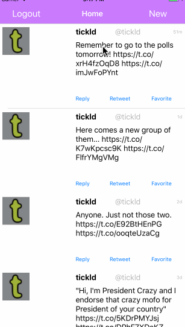

# Project 4 - *Name of App Here*

Time spent: **X** hours spent in total

## User Stories

The following **required** functionality is completed:

   - [x] Hamburger menu
   - [x] Dragging anywhere in the view should reveal the menu.
   - [x] The menu should include links to your profile, the home timeline, and the mentions view.
   - [x] The menu can look similar to the example or feel free to take liberty with the UI.
   - [x] Profile page
   - [x] Contains the user header view
   - [x] Contains a section with the users basic stats: # tweets, # following, # followers
   - [x] Home Timeline
   - [x] Tapping on a user image should bring up that user's profile page

The following **optional** features are implemented:

   - [ ] Profile Page
   - [ ] Implement the paging view for the user description.
   - [ ] As the paging view moves, increase the opacity of the background screen. See the actual Twitter app for this effect
   - [ ] Pulling down the profile page should blur and resize the header image.
   - [ ] Account switching
   - [ ] Long press on tab bar to bring up Account view with animation
   - [ ] Tap account to switch to
   - [ ] Include a plus button to Add an Account
   - [ ] Swipe to delete an account

## Video Walkthrough

Here's a walkthrough of implemented user stories:

GIF created with [LiceCap](http://www.cockos.com/licecap/).